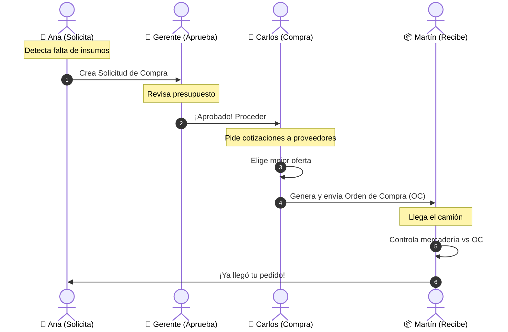
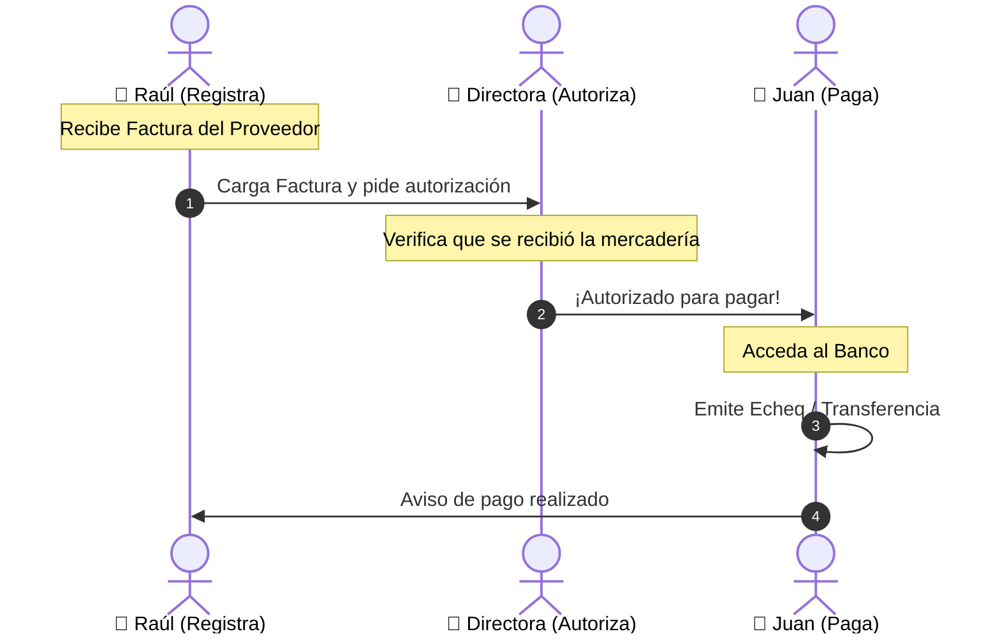
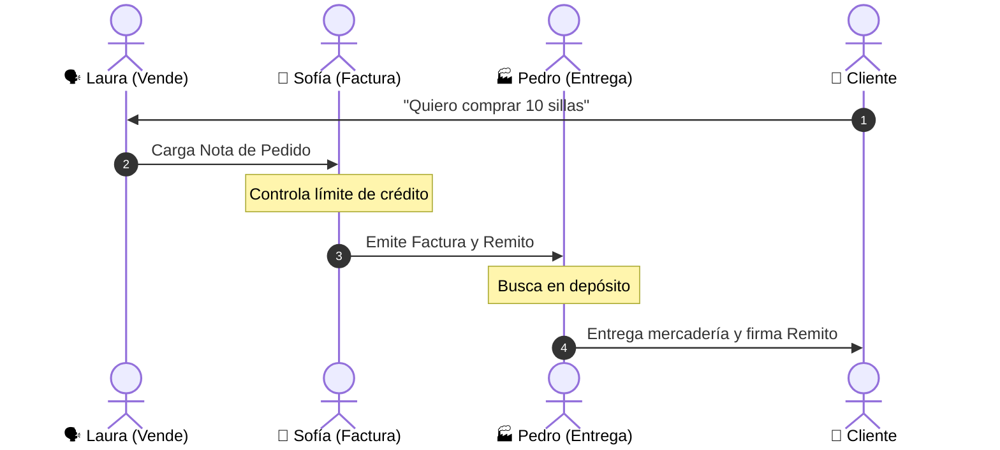

# 📘 Guía Visual de Roles y Tareas (Manual Simplificado)

Bienvenido al sistema de gestión segura de la empresa. Este manual explica de forma sencilla **quién hace qué** y cómo colaboramos para que todo funcione ordenadamente.

---

## 🛒 1. COMPRAS: ¿Cómo compramos algo?

El proceso de compra involucra a 4 personas trabajando en equipo. Nadie puede comprar solo, ¡necesitamos al equipo!

### 🎭 Los Protagonistas

| Persona | Rol en Sistema | Su Misión |
| :--- | :--- | :--- |
| **🙋 Ana (Solicitante)** | `SOLICITANTE_COMPRAS` | **Levanta la mano**: "¡Necesitamos resmas de papel!" |
| **👔 Gerente (Aprobador)** | `APROBADOR_COMPRAS` | **Autoriza**: "Ok, hay presupuesto." |
| **💼 Carlos (Comprador)** | `COMPRADOR` | **Negocia**: "Conseguí buen precio con el proveedor X." |
| **📦 Martín (Recepción)** | `RECEPCIONISTA` | **Recibe**: "Llegaron las cajas, todo en orden." |

### 🛤️ El Camino de una Compra



---

## 💰 2. PAGOS: ¿Cómo pagamos las facturas?

Una vez que compramos, hay que pagar. Pero con control.

### 🎭 Los Protagonistas

| Persona | Rol en Sistema | Su Misión |
| :--- | :--- | :--- |
| **📝 Raúl (Cuentas)** | `CUENTAS_POR_PAGAR` | **Organiza**: "Tengo la factura y el remito firmados." |
| **👔 Directora (Autoriza)** | `AUTORIZADOR_PAGOS` | **Da el OK**: "Correcto, procedan al pago." |
| **💸 Juan (Tesorería)** | `TESORERO` | **Paga**: "Transferencia realizada." |

### 🛤️ El Camino del Dinero (Salida)



---

## 🤝 3. VENTAS: ¿Cómo vendemos a un cliente?

Desde que el cliente llama hasta que se lleva el producto.

### 🎭 Los Protagonistas

| Persona | Rol en Sistema | Su Misión |
| :--- | :--- | :--- |
| **🗣️ Laura (Ventas)** | `VENDEDOR` | **Vende**: "Hola cliente, aquí tienes tu presupuesto." |
| **📄 Sofía (Facturación)** | `FACTURACION` | **Factura**: "Aquí está tu factura A/B." |
| **🏭 Pedro (Almacén)** | `ALMACENISTA` | **Entrega**: "Aquí tienes tu producto." |

### 🛤️ El Camino de una Venta



---

## 💵 4. COBRANZAS: ¿Cómo entra el dinero?

¡La venta no termina hasta que se cobra!

### 🎭 Los Protagonistas

| Persona | Rol en Sistema | Su Misión |
| :--- | :--- | :--- |
| **📞 María (Cobranzas)** | `COBRANZAS` | **Gestiona**: "Hola, te recuerdo tu factura vencida." |
| **💸 Juan (Tesorería)** | `TESORERO` | **Guarda**: "Recibí los cheques y los deposité." |
| **📊 Roberto (Contador)** | `CONTADOR` | **Controla**: "El banco coincide con los recibos." |

### 🛤️ El Camino del Dinero (Entrada)

```mermaid
graph LR
    C[👤 Cliente] -->|Paga| M[📞 María<br>(Emite Recibo)]
    M -->|Entrega Cheques| J[💸 Juan<br>(Tesorería)]
    J -->|Deposita| B[🏦 Banco]
    B -.->|Extracto| R[📊 Roberto<br>(Concilia)]
```

---

## 🛡️ Resumen de Seguridad

Para cuidar la empresa, usamos una regla de oro: **"Cuatro Ojos"**.

1.  **Quien pide no compra.** (Ana pide, Carlos compra).
2.  **Quien compra no paga.** (Carlos compra, Juan paga).
3.  **Quien vende no entrega.** (Laura vende, Pedro entrega).
4.  **Quien cobra no gasta.** (María cobra, Juan custodia).

¡Así nos cuidamos entre todos!
